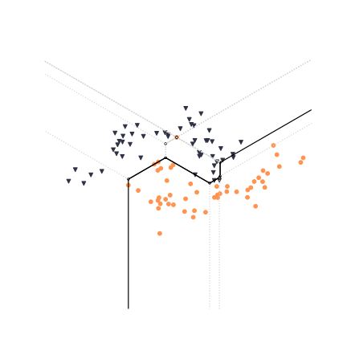
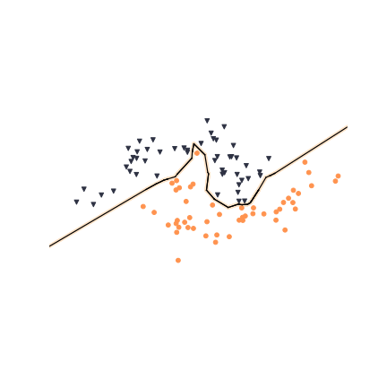
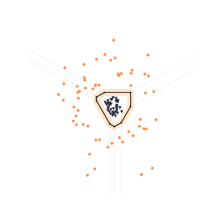
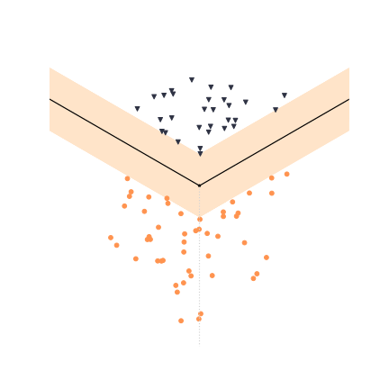
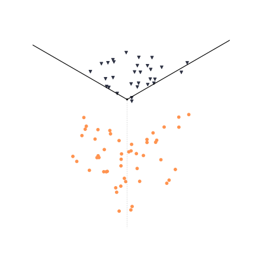
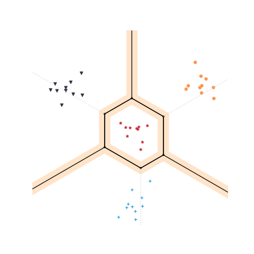
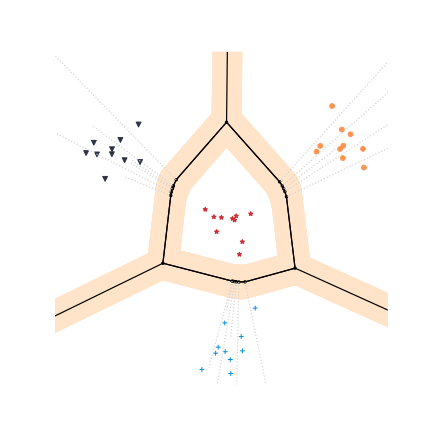

# tropical-svm

tropy is a Python library for efficiently fitting piecewise linear models using tropical geometry and mean payoff games. It is distributed under the MIT License.

## Installation

If you already have a working installation of NumPy, the easiest way is to clone this repository.

### Dependencies

tropy was tested on Python 3.9 and NumPy 1.25. Graphing capabilities require Matplotlib. tropy still relies on Pandas (for saving weights), scikit-learn (for computing accuracies) and tqdm, even though these dependencies could easily be removed.

## Quickstart

### Playground

The easiest way to play with tropy and to reproduce graphs made in the paper is to use script `playground.py`. It allows to fit tropical polynomials on provided 3D datasets and to graph the results.

```
usage: playground.py [-h] [-s [file_path]] [--beta BETA] [--simplified]
                     [--feature-selection no_features]
                     {iris,iris-binary,moons,toy,toy-centers,toy-reverse,toy-centers-reverse,bintoy,bintoy-separated,bintoy-mixed,circular}
                     [degree]

Fitting and plotting tropical piecewise linear classifiers on 3D datasets

positional arguments:
  {...}                 Dataset to classify
  degree                Degree of tropical polynomial

optional arguments:
  -h, --help            Show this help message and exit
  -s [file_path], --save [file_path]
                        Save the figure (.PGF)
  --beta BETA           If specified, Beta value for using 'linear SVM on log paper' trick
  --simplified          Provide a simplified view of the hypersurface, with the decision boundary only
  --feature-selection no_features
                        Experimental: heuristic to generate more relevant
                        monomials based on data. Specify the number of points to sample per class if wanted. Bypasses degree option.

```

| Commands | Results |
|--|--|
| `./playground.py moons 3` <br /><br /> `./playground.py moons --feature-selection 5 --simplified` |   |
| `./playground.py circular 3` <br /><br /> `./playground.py circular --feature-selection 5` |   |
| `./playground.py bintoy-separated 1` <br /><br /> `./playground.py bintoy-separated 1 --beta 10` |   |
| `./playground.py toy-reverse 3` <br /><br /> `./playground.py toy-reverse --feature-selection 3` |   |


### Fitting custom datasets

tropy is only able of plotting tropical polynomials for 3-dimensional data, but it can perform classification in much higher dimensions.

To fit a classifier based on a cubic tropical polynomial, for instance:
```python
from tropy.svm import TropicalSVC
model = TropicalSVC()
model.fit(Xtrain, poly_degree = 3)
```
where `Xtrain` is a list of NumPy 2D arrays. Each of them corresponds to some data class, and stores data points as columns.

To evaluate model accuracy on test data:
```python
acc = model.accuracy(Xtest)
```

Methods `model.predict`, `model.export_weights` and `model.load_weights` are also provided.

### Plotting tropical hypersurfaces

Module `tropy.graph` comes with a handful of methods to plot tridimensional tropical hypersurfaces. Feel free to use them for custom purposes.

## Other experiments

- `tropicalization.py` shows that *Maslov's dequantization* of classical SVMs does not produce good results.
- `evaluation_datasets.py` and `evaluation_scaling.py` runs the proof-of-concept evaluation on very simple datasets.